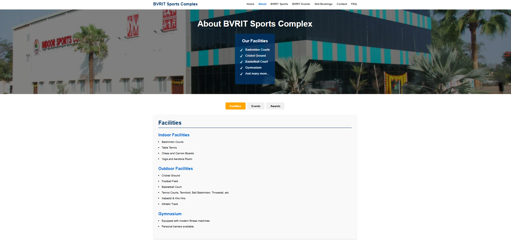
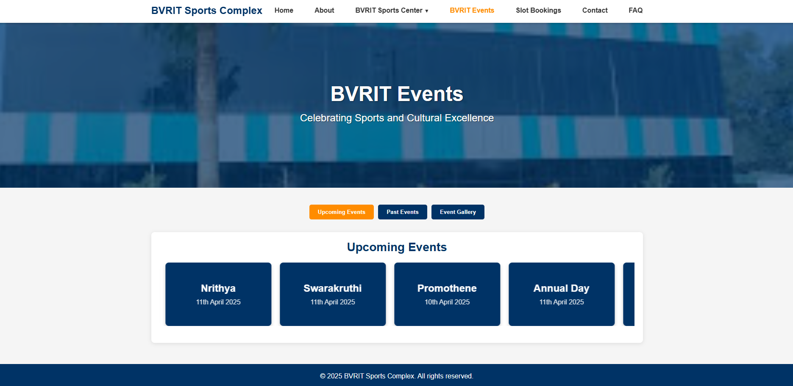
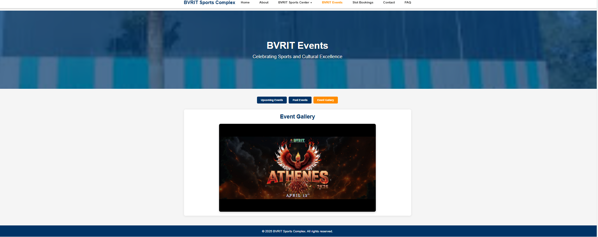
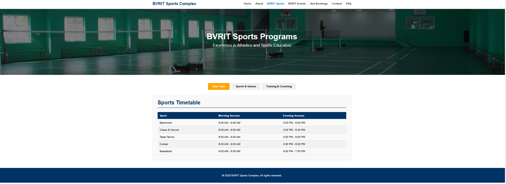
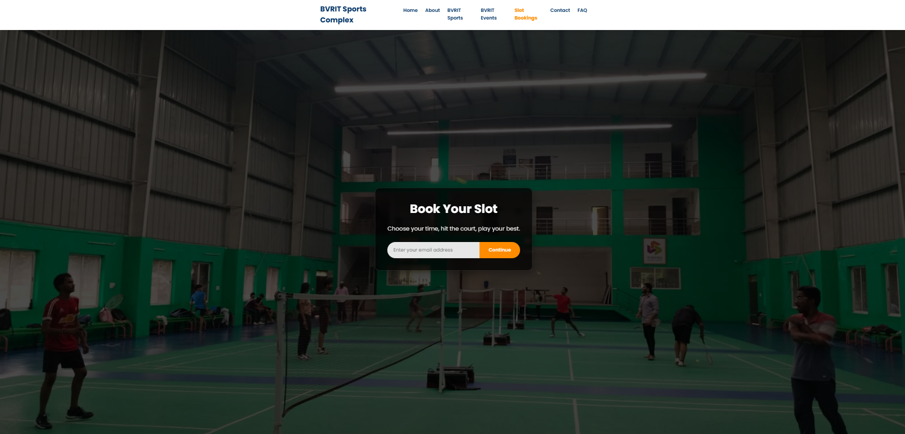
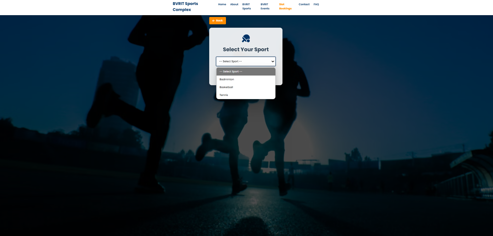
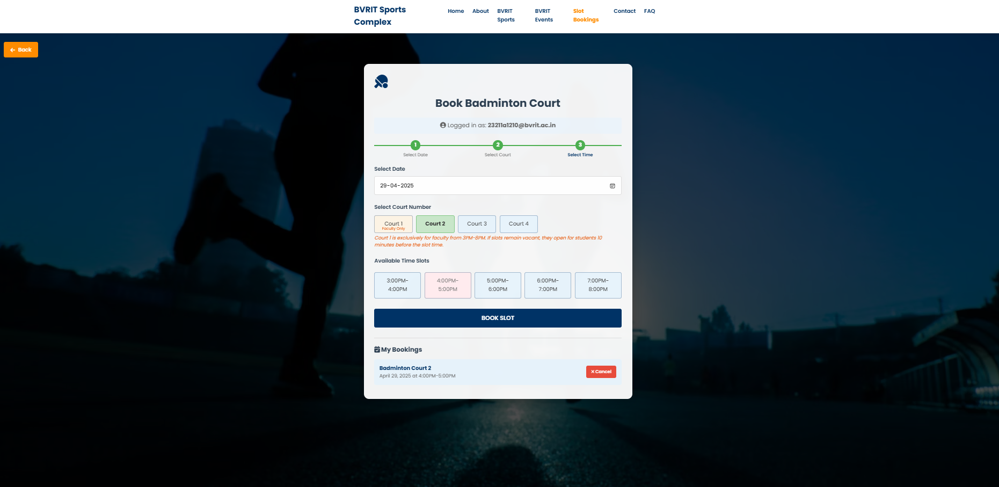
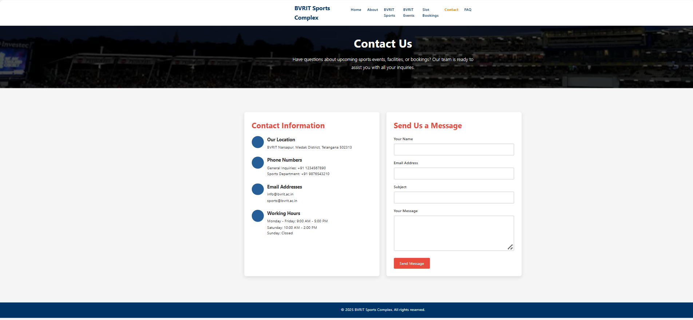
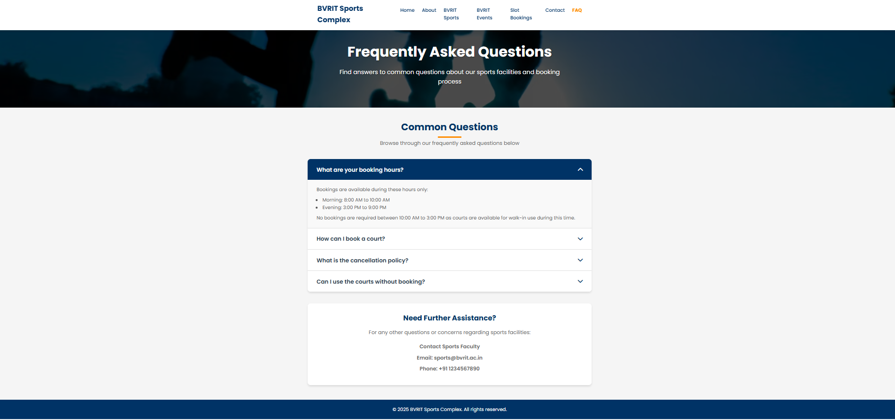

# 🏟️ BVRIT Sports Complex Management System

<p align="center">
  <b>🚀 Smart Sports Facility & Slot Booking Platform</b><br>
  Built to streamline sports activities, events, and court bookings at BVRIT
</p>

<p align="center">
  
  
  
  
</p>

---

## Overview

The **BVRIT Sports Complex Management System** is a full-stack web application that digitalizes sports operations including:

* 🏸 Court Booking
* 📅 Event Management
* 🏅 Sports Scheduling
* 👤 Role-Based Access

It ensures a seamless experience for **students, faculty, and administrators**.

---

## Key Highlights

✔️ Real-time slot booking system
✔️ Faculty vs Student court access logic
✔️ Dynamic event management
✔️ Responsive UI design
✔️ Booking cancellation system

---

##  Features

###  Home & About

* Welcome dashboard
* Vision & objectives
* Sports committee details

---

###  Sports Module

*  Timetable (Morning & Evening sessions)
*  Individual & Team sports
*  Training & coaching programs

---

###  Events System

*  Upcoming Events (Card UI)
*  Past Events (Achievements)
*  Event Gallery

---

### 🎟️ Slot Booking (Core Module)

#### ⚙️ Booking Flow

```text
Select Sport → Select Date → Select Court → Select Time → Confirm Booking
```

#### 🏟️ Smart Rules

* Court 1 → Faculty only
* Opens to students **10 mins before if free**
* Courts 2–4 → Students

####  Features

* Real-time slot updates
* Disabled booked slots
* My Bookings dashboard
* Cancel booking option

---

### 📞 Contact & FAQ

* Contact form
* Working hours
* Booking rules & FAQs

---

## 🛠️ Tech Stack

| Layer    | Technology            |
| -------- | --------------------- |
| Frontend | HTML, CSS, JavaScript |
| Backend  | Flask (Python)        |
| Database | SQLite                |
| ORM      | SQLAlchemy            |

---

## 📸 Screenshots

### 🏠 Home Page


### ℹ️ About Page


### 🏅 Facilities


### 📅 Events




### 📊 Timetable



### 🎟️ Booking Entry



### 🎯 Select Sport



### 🏸 Booking UI



### 📞 Contact Page



### ❓ FAQ



---

## ⚙️ Installation

### 1️⃣ Clone Repo

```bash
git clone https://github.com/thanuja1906/COLLEGE-EVENTS-AND-SPORTS-HUB.git
cd COLLEGE-EVENTS-AND-SPORTS-HUB
```

### 2️⃣ Setup Environment

```bash
python -m venv venv
venv\Scripts\activate
```

### 3️⃣ Install Dependencies

```bash
pip install -r requirements.txt
```

### 4️⃣ Run App

```bash
python app.py
```

### 🌐 Open

```
http://127.0.0.1:5000/
```

---

## 📂 Project Structure

```bash
BVRIT-Sports-Complex/
│
├── static/
├── templates/
├── screenshots/
├── app.py
├── requirements.txt
└── README.md
```

---

## 🔐 Admin Capabilities

* 📊 View all bookings
* 📁 Export to Excel
* 🔒 Restricted admin access

---

## 📈 Future Improvements

* 💳 Payment integration
* 📱 Mobile app
* 🔔 Notifications system
* 📊 Analytics dashboard
* 🤖 Smart booking suggestions

---

## 👩‍💻 Author

**Thanuja**

---

## ⭐ Support

If you like this project:

🌟 Star the repo
🍴 Fork it
📢 Share it

---
